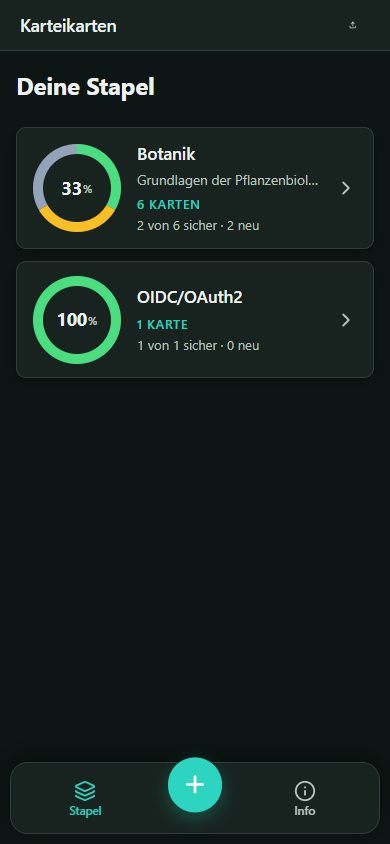
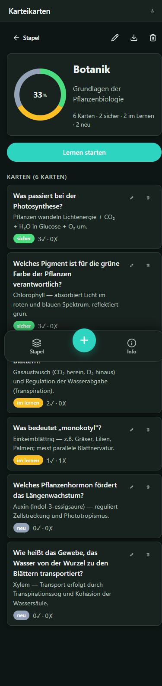
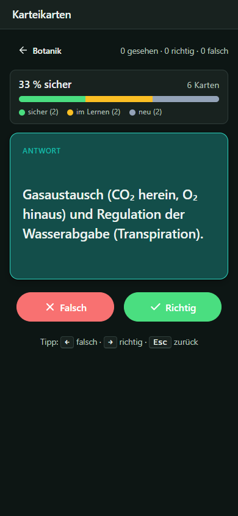

# Karteikarten

Eine kleine, schnelle Web-App zum Lernen mit Karteikarten — komplett im Browser,
ohne Konto, ohne Cloud. Die Bewertung „richtig / falsch" machst **du** selbst;
die App sortiert deine Karten danach so um, dass schwache und neue Karten
häufiger erscheinen als sichere.

Mobile-first gebaut, mit Dark-Mode, Tastatur-Shortcuts und A11y-freundlich.
Als **PWA** auf dem iPhone-Homescreen installierbar — fühlt sich an wie eine
native App.

**Live-Demo**: [https://jkrieger.github.io/FlashCardLearning/](https://jkrieger.github.io/FlashCardLearning/)

---

## Screenshots

<table>
  <tr>
    <td align="center" width="33%">
      
      <br/>
      <sub><b>Stapel-Übersicht</b><br/>Donut-Chart pro Deck zeigt sicher / im Lernen / neu</sub>
    </td>
    <td align="center" width="33%">
      
      <br/>
      <sub><b>Stapel-Detail</b><br/>Großer Donut, „Lernen starten"-Button, Karten-Liste mit Status</sub>
    </td>
    <td align="center" width="33%">
      
      <br/>
      <sub><b>Lernmodus</b><br/>Karte umgedreht, mit Richtig/Falsch-Buttons und Tastatur-Shortcuts</sub>
    </td>
  </tr>
</table>

---

## Was kann sie

- **Mehrere Stapel** für unterschiedliche Themen (z.B. Botanik, OIDC/OAuth2, Vokabeln)
- **Gewichtete Wiederholung**: falsche und neue Karten erscheinen häufiger als sichere
- **Drei-Zustand-Fortschritt** pro Karte: neu → im Lernen → sicher
- **Fortschritt visuell** als Donut-Chart (mastered / learning / new) plus Prozent
- **Tastatur-Bedienung** im Lernmodus: <kbd>Leertaste</kbd> umdrehen, <kbd>→</kbd> richtig, <kbd>←</kbd> falsch, <kbd>Esc</kbd> zurück
- **Mobile-first** Layout mit Bottom-Nav und kontext-sensitivem **+**-FAB
  (legt einen neuen Stapel oder eine neue Karte an, je nach Ansicht)
- **JSON Export / Import** pro Stapel — für Backups oder Übertragung zwischen Geräten
- **Offline-fähig** als PWA, installierbar auf iOS / Android-Homescreen
- **Dark Mode** automatisch via `prefers-color-scheme`
- **A11y**: Skip-Link, sichtbarer Fokus-Ring, ARIA-Progressbar, Live-Regionen,
  konsistente Heading-Hierarchie, Touch-Targets ≥ 44 px

---

## Tech-Stack

| Schicht | Wahl |
|---|---|
| UI | React 18 + TypeScript |
| Routing | React Router (Hash-Router, für GitHub-Pages-Subpfad ohne Fallback-Konfig) |
| Build | Vite 5 |
| Persistenz | IndexedDB via [Dexie](https://dexie.org/) |
| PWA | [vite-plugin-pwa](https://vite-pwa-org.netlify.app/) + Workbox |
| Icons | [lucide-react](https://lucide.dev) |
| Deployment | GitHub Pages (via Actions) |

Keine Datenbank, kein Backend, keine Authentifizierung — alle Daten leben
in der IndexedDB deines Browsers. Es gibt nichts hochzuladen.

---

## Lokale Entwicklung

### Voraussetzungen

- Node.js ≥ 20
- npm

### Setup

```bash
git clone https://github.com/jKrieger/FlashCardLearning.git
cd FlashCardLearning
npm install
```

### Skripte

```bash
npm run dev        # Dev-Server auf http://localhost:5173/
npm run build      # Production-Build nach dist/
npm run preview    # Lokale Vorschau des Builds (http://localhost:4173/FlashCardLearning/)
```

### Im LAN testen (z.B. vom iPhone)

Der Dev-Server hört auf alle Interfaces — du erreichst ihn aus dem gleichen WLAN
unter der IP deines Rechners (`ipconfig` / `ifconfig`):

```
http://<deine-ip>:5173/
```

Falls deine Firewall den Port blockt, einmal Port 5173 freigeben.

---

## Auf dem iPhone installieren

1. Im **Safari** [die Live-URL](https://jkrieger.github.io/FlashCardLearning/) öffnen
2. **Teilen**-Button (Quadrat mit Pfeil) → **„Zum Home-Bildschirm"**
3. Name bestätigen → **„Hinzufügen"**
4. Das Karteikarten-Icon liegt jetzt auf deinem Homescreen.
   Antippen öffnet die App im Vollbild — keine Browserleisten, fühlt sich
   nahezu nativ an.

**Daten** liegen in der IndexedDB des iPhone-Safari. Pro Gerät separat.
Übertragung zwischen Geräten über die JSON-Export-Funktion pro Stapel.

---

## Algorithmus (gewichtete Wiederholung)

Jede Karte hat ein **Gewicht** (`weight`) zwischen `1` und `20`.

- **Neue Karte**: Startgewicht `10`
- **Richtig beantwortet**: `weight = max(1, weight - 3)`
- **Falsch beantwortet**: `weight = min(20, weight + 5)`

Beim Ziehen der nächsten Karte wird **gewichtet zufällig** aus dem Pool gewählt
(höheres Gewicht → höhere Auswahlwahrscheinlichkeit). Die letzten 2 gesehenen
Karten werden ausgeblendet, damit nicht dieselbe Karte zweimal hintereinander
erscheint.

Eine Karte gilt als **sicher**, wenn `correctCount >= 3 && weight <= 2`.
Als **neu** gilt sie, solange weder richtig noch falsch beantwortet wurde.
Sonst ist sie **im Lernen**.

Quelle: [`src/domain/algorithm.ts`](src/domain/algorithm.ts)

---

## Daten / Persistenz

Zwei Tabellen in der IndexedDB `flashcards-db`:

```ts
interface Deck {
  id: string;            // uuid
  name: string;
  description?: string;
  createdAt: number;     // epoch ms
  updatedAt: number;
}

interface Card {
  id: string;
  deckId: string;        // FK
  front: string;         // Frage
  back: string;          // Antwort
  weight: number;        // 1..20
  correctCount: number;
  wrongCount: number;
  lastSeenAt: number | null;
  createdAt: number;
  updatedAt: number;
}
```

Daten verlassen nie den Browser. Backup → JSON-Export pro Stapel.
Format-Definition: [`src/util/jsonIO.ts`](src/util/jsonIO.ts).

---

## Architektur (eine Datei pro Verantwortung)

```
src/
  main.tsx                React-Einstieg + Router
  App.tsx                 App-Layout, Header, BottomNav, Routen
  routes/
    DeckList.tsx          „/" Stapel-Übersicht
    DeckDetail.tsx        „/decks/:id" Detail + Karten-Liste
    Study.tsx             „/decks/:id/study" Lernmodus
    CardEditor.tsx        Karte hinzufügen / bearbeiten
    Info.tsx              „/info" App-Info + Bedienungs-Hilfe
  components/
    BottomNav.tsx         Floating-Bar mit kontext-sensitivem +-FAB
    DeckTile.tsx          Listen-Item für DeckList
    DeckDonut.tsx         SVG-Donut mit 3 Segmenten (mastered/learning/new)
    FlipCard.tsx          Frage/Antwort-Umschalter
    ProgressBar.tsx       3-Segment-Balken + Prozent (im Lernmodus)
    ConfirmDialog.tsx     Custom-Modal mit Focus-Trap
  db/
    database.ts           Dexie-Schema
    decks.ts              CRUD für Decks
    cards.ts              CRUD für Karten
  domain/
    types.ts              Deck, Card, DeckStats
    algorithm.ts          Gewichtete Auswahl, applyAnswer
    stats.ts              computeDeckStats
  util/
    title.ts              useDocumentTitle
    format.ts             pluralize / cardWord
    id.ts                 UUID-Helper
    jsonIO.ts             Export / Import
  styles/
    globals.css           Eine zentrale CSS-Datei mit Variablen für Light/Dark
```

---

## Deployment

`main`-Pushes triggern automatisch den GitHub-Actions-Workflow
[`.github/workflows/deploy.yml`](.github/workflows/deploy.yml):

1. `npm ci` + `npm run build`
2. Upload des `dist/`-Outputs als Pages-Artifact
3. Deploy nach GitHub Pages

Erstmaliges Einrichten erfordert in den Repo-Settings:
**Settings → Pages → Source: „GitHub Actions"**.

---

## Lizenz

Personal-Projekt — keine Lizenz angegeben. Wenn du diesen Code als Vorlage
für eigene Projekte nutzen willst, gerne — eine kurze Notiz freut den Autor.
